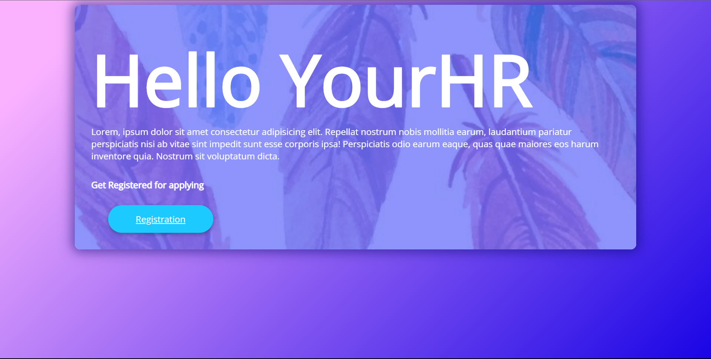

# Sizzle

I have created only 2 pages, Index and Register. Users can get themselves register and upload personal details and link for resume. The data will be stored in mongo db and can fetched if reqired.

# Screenshots

